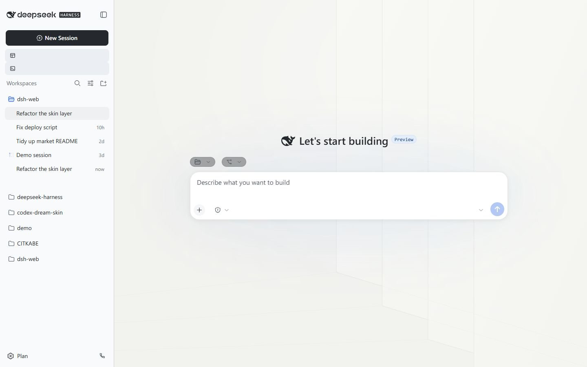
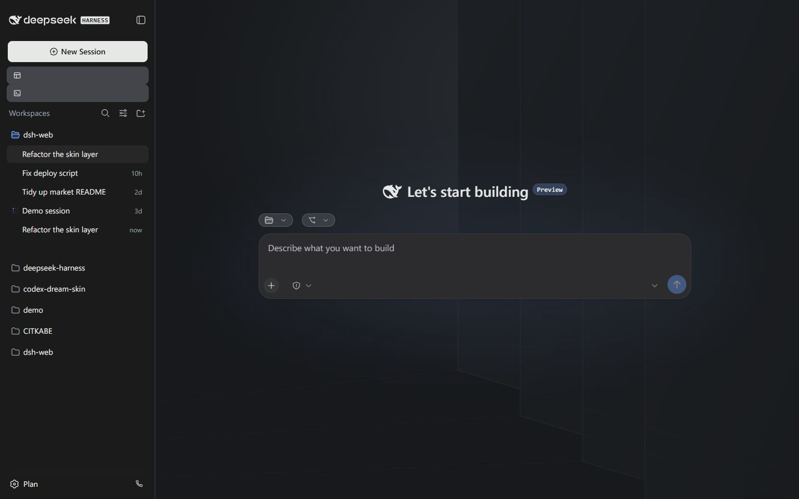

# DCode 石墨工作台

[English](README.md)

基于 DCode 工作台提取的皮肤中心 v2 资产包：纸白与石墨配色、分层面板、
圆角控件和原创建筑光影矢量背景。两张背景均为本地静态 SVG。




## 依赖

需要 DSH Web，并启用 `@linxin666/dsh-client-ui-skin-center`。皮肤没有 npm
依赖、Cordis 接线、可执行 hooks 或网络资源。加载、明暗切换、背景渲染和
卸载清理由皮肤中心负责。

完整的 `@dsh-portable/dcode-ui` 工作台是独立界面插件，使用此皮肤**不需要**
安装该工作台。Git、学习、用量统计、插件管理等能力仍归各自插件所有；
安装皮肤不会安装或启用这些功能，也不会切换当前界面。

## 本地安装

把本目录完整复制到 `$DSH_HOME/skins/dcode/`（通常为
`~/.dsh/skins/dcode/`）。刷新界面，在“设置 → 皮肤中心”选择
“DCode 石墨工作台”。选择官方皮肤即可恢复默认外观。

也可以在已构建的 dsh-web 仓库中运行：

```sh
node scripts/dsh-skin validate /absolute/path/to/skins/dcode
node scripts/dsh-skin install /absolute/path/to/skins/dcode
```

## 贡献上游

把本目录复制到 dsh-web 的 `packages/skins/skin-center/skins/dcode/`，
按其最新 CONTRIBUTING.md 向 `dev` 提交皮肤贡献。皮肤 PR 不包含
Portable 工作台代码或其插件依赖。

```sh
node scripts/dsh-skin validate packages/skins/skin-center/skins/dcode
pnpm market:build
node scripts/capture-previews dcode --serve
pnpm market:build
pnpm market:check
pnpm skin-center:check
```

提交前还需运行上游要求的其他仓库门禁。随附预览使用上游的
official-facade 试穿渲染器，展示静态壳层上的皮肤，不是运行中智能体会话。

`skin.css` 使用 L1 token 和 L2 语义属性；`patches.css` 为旧壳层和静态
预览提供少量 L3 兼容样式，只使用稳定的 `data-pane`、`data-phase` 和
`data-dsh-frame` 属性。不依赖哈希类名，不替换布局，不包含动画或脚本
hooks。未输出语义属性的插件只获得 token 层的配色覆盖。

## 许可

MIT。背景和样式由 Portable 项目贡献者原创，见 [LICENSE](LICENSE)。
预览壳层中的品牌标识归各自权利人所有。
